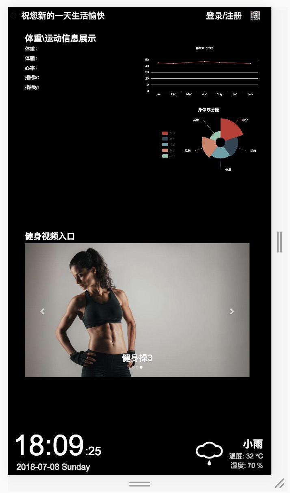

# 系统整体架构
```
Mirror-Display/
| +- .vscode/
| |
| +- setting.json <-- VSCode 配置文件
|
+- Modules/
| |
| +- css/
| | |
| | +- bootstrap.min.css
| | |
| | +- bootstrap.min.css.map
| | |
| | +- index.css <-- 页面样式
| |
| +- js/
| | |
| | +- web_workers/ <-- 实验性 web_workers
| | |
| | +- bootstrap.min.js
| | |
| | +- bootstrap.min.js.map
| | |
| | +- crypto-js.js <-- 哈希算法依赖
| | |
| | +- hmac-sha1.js <-- 哈希算法
| | |
| | +- jquery-3.3.1.min.js
| | |
| | +- moment.min.js
| | |
| | +- jquery.nodom.js
| | |
| | +- index.js <-- 页面脚本
|
+- Resource/ <-- 素材资源文件
|
+- Server/
| |
| +- Mirror-Face-Recognition/
| |
| +- voice/
| |
| +- core.py
| |
| +- main.py
| |
| +- test.py
| |
| +- getTemperature.py
| |
| +- getHumidity.py
|
+- index.html <-- 主要显示界面
|
+- weather-example.json <-- 天气信息 JSON 样例
```


# 健康魔镜主屏

